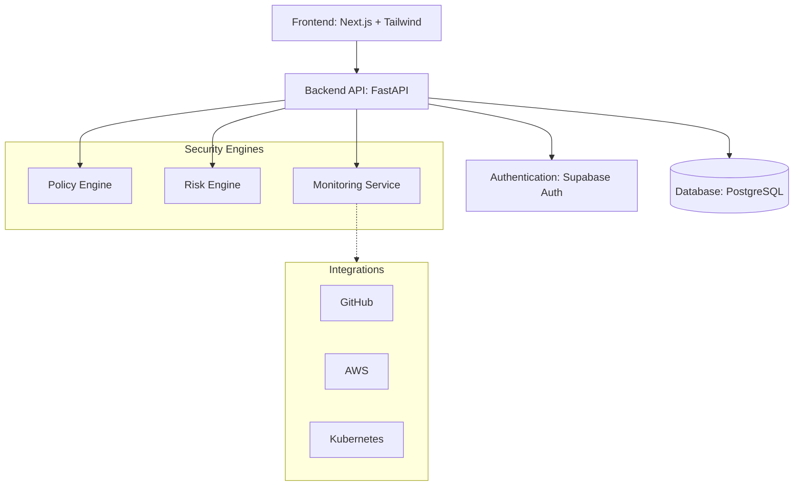
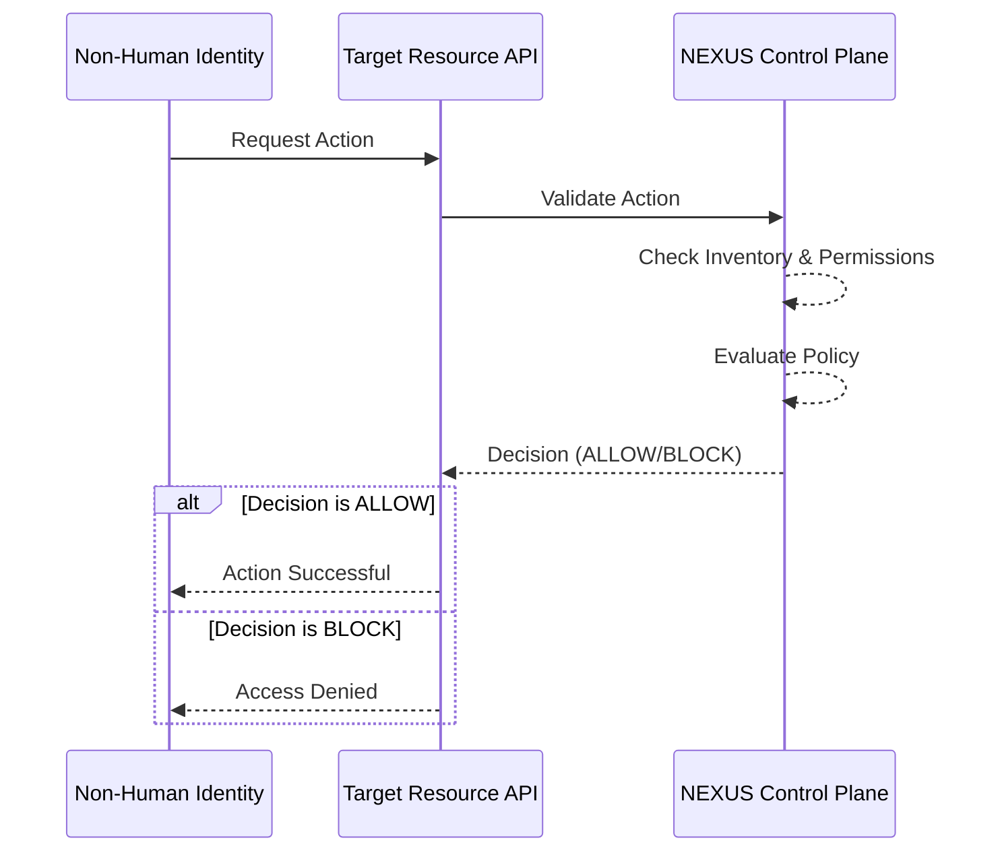
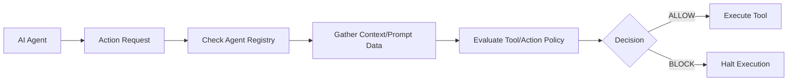
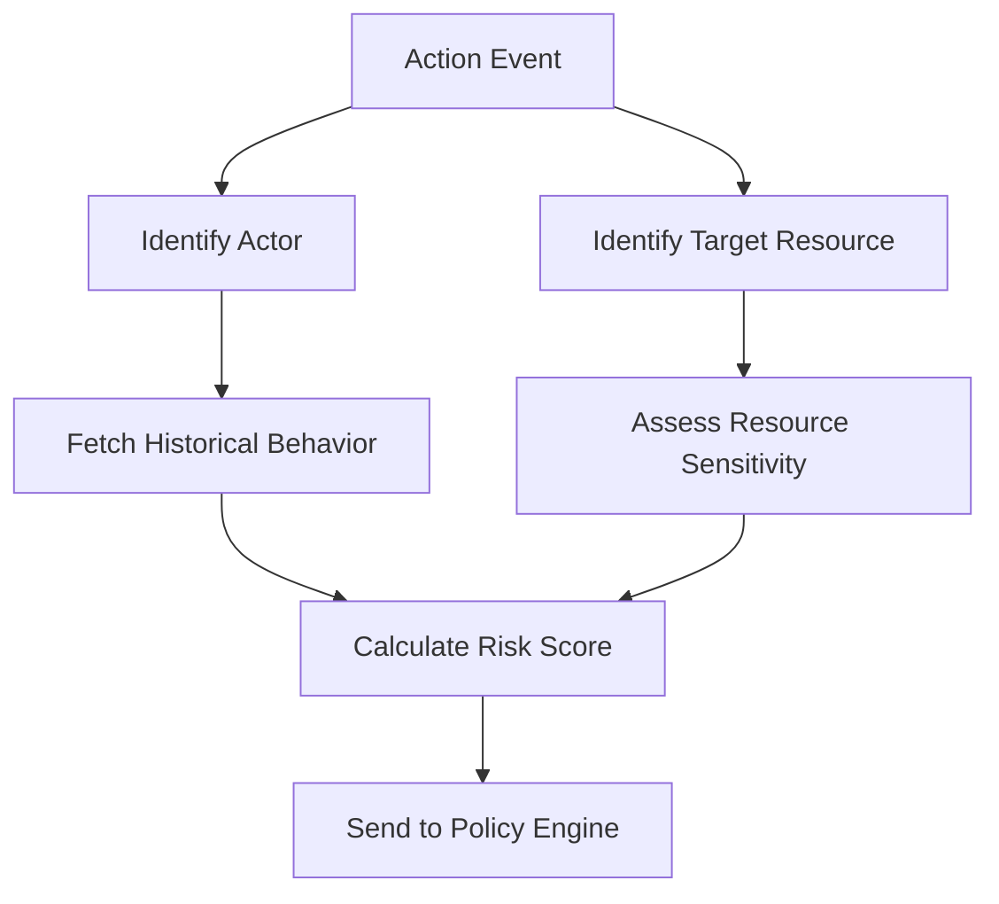
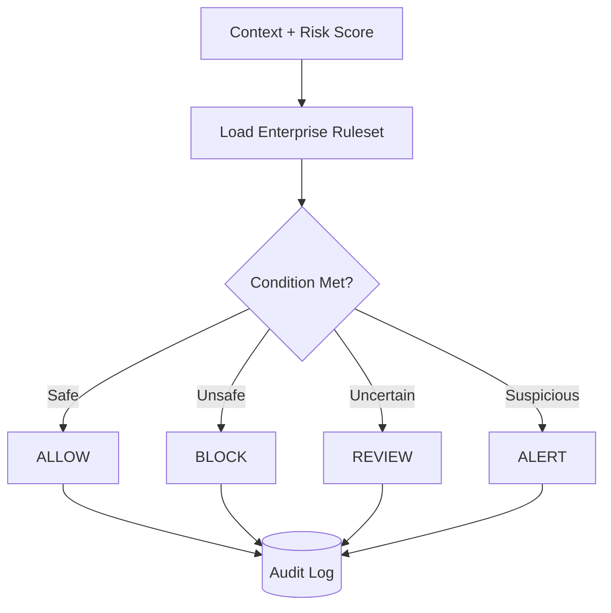

# System Architecture

## Technology Stack Overview
- **Frontend**: Next.js, TypeScript, Tailwind CSS
- **Backend**: Python, FastAPI
- **Database**: PostgreSQL
- **Authentication**: Supabase Auth

## Security Services
The backend is composed of several decoupled services, allowing for scalability and focused responsibility:
- **Identity Service**: Manages the NHI inventory and discovery.
- **Agent Service**: Manages the AI Agent registry and capabilities.
- **Risk Engine**: Evaluates context and calculates dynamic risk scores.
- **Policy Engine**: Processes rules and outputs decisions (ALLOW/BLOCK/REVIEW/ALERT).
- **Monitoring Service**: Observes incoming telemetry and tracks behavior.
- **Alert Service**: Routes notifications to external systems.
- **Audit Service**: Handles immutable logging of all events and decisions.

## Future Infrastructure Integrations
- **GitHub**: To discover CI/CD identities and code-embedded secrets.
- **AWS**: To monitor IAM roles and cloud service accounts.
- **Kubernetes**: To govern cluster service accounts and pod identities.

## Architecture Diagrams

### 1. High-Level Architecture

### 2. Identity-to-Resource Flow

### 3. AI-Agent Security Flow

### 4. Risk Evaluation Flow

### 5. Policy Enforcement Flow

